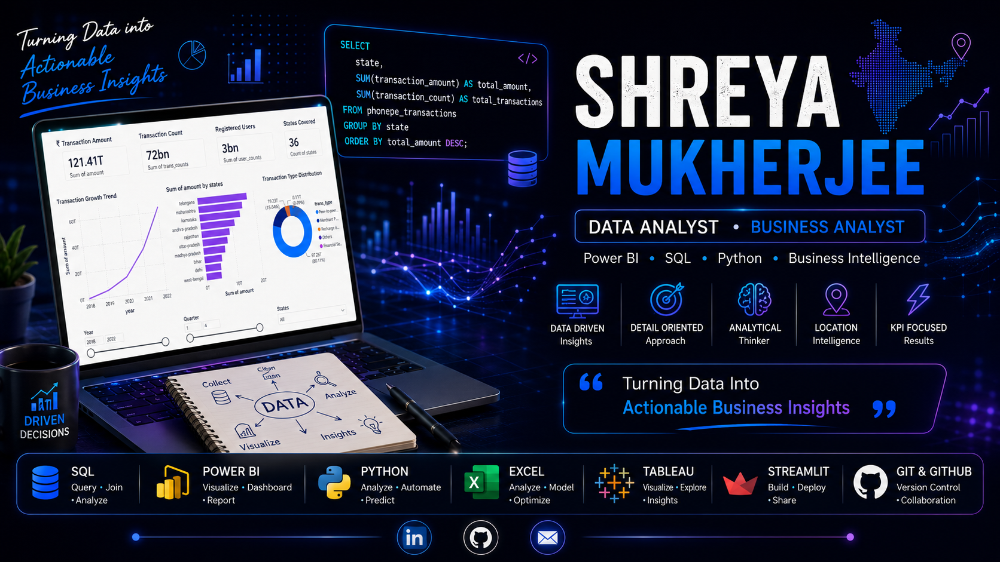
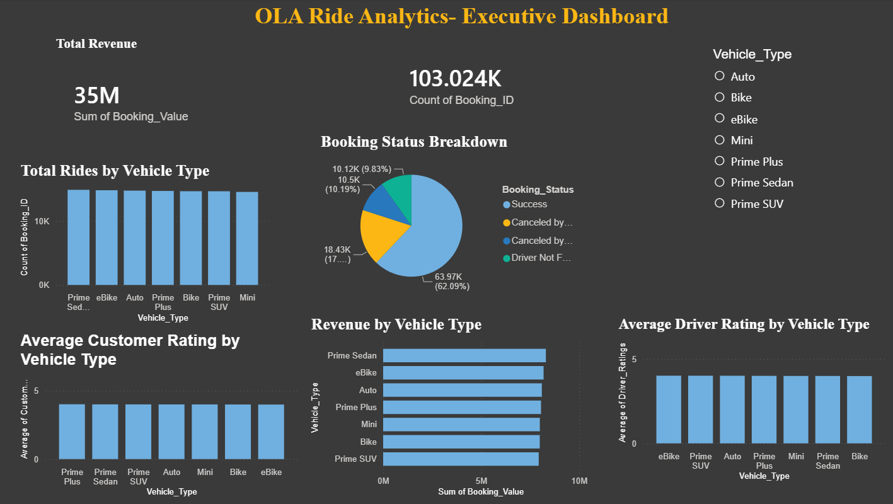
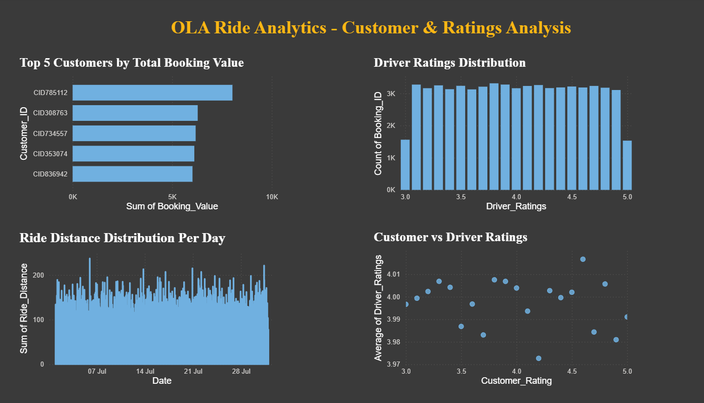
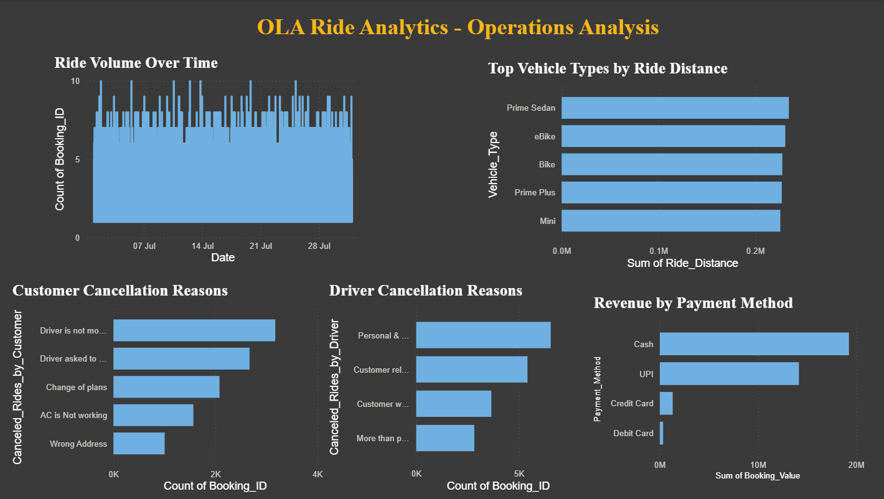

<p align="center">
  
</p>
<br>
<h1 align="center">👋 Hi, I'm Shreya Mukherjee</h1>


<p align="center">
  
</p>

<p align="center">
💼 Passionate about solving business problems through data analytics.<br>
📊 Building real-world projects in SQL, Python, Power BI & Excel.<br>
🚀 Currently focused on becoming a job-ready Data Analyst & Business Analyst.
</p>

---

## 🛠 Tech Stack

<p align="center">


</p>

<p align="center">


</p>

---

# 📂 Featured Projects

---
<div align="center">

# 📊 Data Analytics Projects

</div>


# 📱 PhonePe Pulse Analytics Dashboard | Power BI

> Interactive Business Intelligence dashboard built to analyze India's digital payment ecosystem using the PhonePe Pulse dataset.

### 🛠️ Tools Used

`Power BI` • `Power Query` • `DAX` • `Microsoft Excel`

### ✨ Highlights

- Analyzed digital payment data across **36 Indian states** from **2018–2022**.
- Built multiple interactive dashboards using Power BI.
- Created KPIs using DAX measures.
- Performed data cleaning, transformation and data modeling.
- Designed interactive maps, trend analysis and drill-down reports.
- Generated business recommendations based on transaction and user behavior.

### 📊 Dashboard Features

- Executive Overview Dashboard
- Transaction Analysis Dashboard
- User Analysis Dashboard
- Geo Mapping Dashboard
- Geo Analysis Dashboard
- Insights & Recommendations

### 💡 Key Business Insights

- Total Transaction Amount exceeded **₹121.41 Trillion**.
- More than **72 Billion** transactions were analyzed.
- Over **3 Billion** registered users were included.
- Telangana, Maharashtra and Karnataka emerged as top-performing states.
- Peer-to-peer transactions dominated overall transaction volume.
- Q4 consistently recorded the highest transaction activity.
- Xiaomi led mobile brand adoption across users.

### 📈 Skills Demonstrated

- Data Cleaning
- Data Modeling
- DAX Measures
- Business Intelligence
- Interactive Dashboard Design
- KPI Development
- Geospatial Analysis
- Business Insight Generation

### 📄 Report
*Available Soon*

### 📊 Presentation
*Available Soon*

### 🔗 Repository
*Available Soon*

---

# 🚖 OLA Ride Insights Dashboard | SQL • Power BI • Streamlit

> End-to-end Data Analytics project analyzing OLA ride booking data to uncover ride trends, revenue insights, customer behavior, and operational performance.

### 🛠️ Tools Used

`SQL` • `Power BI` • `Excel` • `Streamlit`

### ✨ Highlights

- Analyzed **103,024 ride booking records** across 20 business attributes.
- Cleaned and transformed raw ride booking data for analysis.
- Created SQL queries to answer real business questions.
- Designed an interactive Power BI dashboard with KPIs and visual insights.
- Built a simple Streamlit application to present project findings.
- Identified customer cancellation patterns and driver cancellation reasons.
- Compared payment methods, vehicle performance and booking trends.

### 📊 Business Insights

- Most rides were completed successfully.
- Cash generated the highest revenue, followed by UPI.
- Prime Sedan showed strong operational performance.
- Driver and customer ratings remained consistently high.
- Cancellation analysis highlighted opportunities to improve customer experience.

### 📂 Dashboard Features

- Booking Status Analysis
- Revenue Analysis
- Vehicle Performance
- Ride Distance Analysis
- Customer Ratings
- Driver Ratings
- Cancellation Analysis
- Payment Method Analysis

### 📄 Report
*Available Soon*

### 📊 Presentation
*Available Soon*

### 🔗 Repository
*Available Soon*

---
<div align="center">

# 💼 Finance Analytics Projects

</div>


## 📊 Coal India Limited Financial Analysis

> Financial statement analysis project evaluating the financial performance of Coal India Limited using accounting ratios over a five-year period (2018–2023).

### 🔧 Tools Used

`Microsoft Excel` • `Financial Statement Analysis` • `Ratio Analysis`

### ✨ Highlights

- Conducted a 5-year financial analysis of Coal India Limited (2018–2023).
- Evaluated Liquidity, Profitability and Solvency using key financial ratios.
- Calculated Current Ratio, Quick Ratio, Gross Profit Ratio, Return on Assets (ROA), Debt-to-Equity Ratio and Debt Ratio.
- Interpreted financial trends to assess the company's financial health.
- Provided recommendations based on ratio analysis and financial performance.

---

### 📈 Key Financial Ratios

- 📌 Current Ratio
- 📌 Quick Ratio
- 📌 Gross Profit Ratio
- 📌 Return on Assets (ROA)
- 📌 Debt-to-Equity Ratio
- 📌 Debt Ratio

---

### 💡 Business Insights

- Strong liquidity position with the ability to meet short-term obligations.
- Stable long-term solvency due to a healthy debt-to-equity structure.
- Profitability remained positive, although gross margins declined in recent years.
- Asset utilization improved towards the final year of analysis.
- Overall financial position of Coal India Limited remained stable during the study period.

---

### 🎯 Skills Demonstrated

- Financial Analysis
- Ratio Analysis
- Financial Statement Interpretation
- Business Research
- Microsoft Excel
- Analytical Thinking

---

### 📄 Report
*Available Soon*

### 📊 Presentation
*Available Soon*

### 🔗 Repository
*Available Soon*

---

# 📈 GitHub Stats

<p align="center">


</p>

---

# 🔥 GitHub Contribution Streak

<p align="center">
  
</p>

---

# 🏆 Certifications & Learning Journey

> I believe in continuous learning and consistently improving my skills in Data Analytics, Business Analytics and Business Intelligence.

| Status | Learning Path |
|:------:|---------------|
| ✅ | Microsoft Excel |
| 🔄 | Advanced Excel (Crio.Do) |
| ✅ | Microsoft Power BI |
| 🔄 | Advanced Power BI (Crio.Do) |
| ✅ | SQL |
| ✅ | Tally |
| 🔄 | Python for Data Analytics |
| 🔄 | Business Analytics |
| 🔄 | Statistics for Data Analytics |
| 🔄 | Streamlit |
| 🔄 | Git & GitHub |
| ⏳ | Tableau |
| ⏳ | Machine Learning Fundamentals |

### Status Legend

- ✅ Completed
- 🔄 Currently Learning
- ⏳ Planned

---

# 🎯 2026 Learning Goals

- ✅ Build 10+ Real-World Data Analytics Projects
- 🔄 Master SQL
- 🔄 Master Power BI
- 🔄 Master Python for Data Analytics
- 🔄 Learn Advanced Excel
- 🔄 Learn Business Analytics
- 🔄 Learn Statistics for Data Analytics
- 🔄 Build Interactive Streamlit Applications
- ⏳ Learn Tableau
- ⏳ Explore Machine Learning Fundamentals

---

# 📫 Let's Connect

<p align="center">

<a href="https://www.linkedin.com/in/shreya-mukherjee-b14076293">

</a>

<a href="mailto:shreyamukherjee115@gmail.com">

</a>

<a href="https://github.com/CallMeShreya">

</a>

<a href="#">

</a>

</p>

---

# 👀 Profile Views

<p align="center">


</p>

---

<div align="center">

## ⭐ Thanks for visiting my profile!

If you like my work, don't forget to ⭐ my repositories.

Let's connect and grow together 🚀

</div>

---

# 🚀 Featured Project

## 🚖 OLA Ride Analytics | Power BI Dashboard
<p align="center">



</p>

A complete end-to-end Data Analytics project built using **Power BI, SQL, Excel, and Python**. This project analyzes ride bookings, customer behavior, revenue trends, vehicle performance, and operational insights to support data-driven decision making.

### 🛠 Tech Stack

<p>


</p>

### 📂 Repository Contents

- 📊 Power BI Dashboard (.pbix)
- 📄 Project Report
- 📑 Presentation (PPT)
- 🗂 Dataset (Excel)
- 🛢 SQL Queries
- 📸 Dashboard Screenshots

---

## 📊 Dashboard Preview

### Executive Dashboard


### Customer & Ratings Analysis



### Operations Analysis



---

## 📁 Project Structure

```text
📂 dataset
📂 images
📂 presentation
📂 report
📂 sql
```

---

## 💡 Key Insights

✔ Revenue Analysis

✔ Ride Trends

✔ Customer Behaviour

✔ Driver Performance

✔ Vehicle-wise Analysis

✔ Cancellation Analysis

✔ Payment Method Analysis

---

⭐ If you like this project, don't forget to give it a ⭐ on GitHub!
