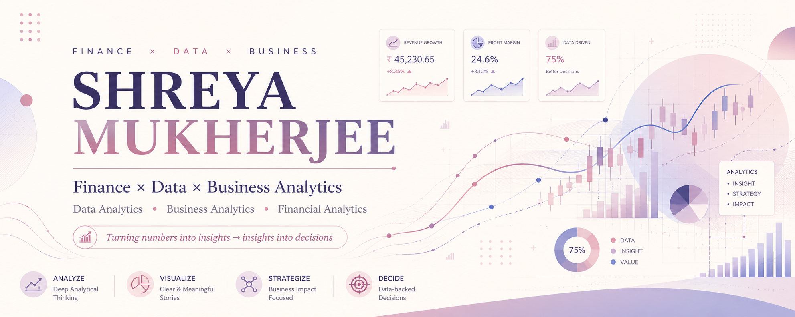

 

  

&nbsp;

&nbsp;

  

<i>Finance gives me the context. Data helps me find the story.</i>

---

# ✦ About Me

I'm **Shreya Mukherjee**, a **Bachelor's graduate in Finance** building my career at the intersection of **Finance, Data, Business, and Technology**.

My journey into analytics comes from a simple idea: **numbers become more valuable when we understand what they mean.**

My Finance background taught me to think about performance, value, risk, profitability, and business decisions. I'm now building on that foundation through hands-on work in **Data Analytics, Business Analytics, Financial Analytics, Business Intelligence, and Data Visualization**.

I enjoy taking a business question, exploring the data behind it, finding patterns, and turning those findings into something that can support a better decision.

I'm currently developing practical skills across **SQL, Python, Excel, Power BI, Tableau, Pandas, NumPy, Streamlit, and Plotly**, while also exploring **AI / GenAI and AI-assisted analytics**.

> **I don't want to analyse data just to describe what happened.  
> I want to understand why it happened — and what could be done next.**

---

### FINANCE → DATA → BUSINESS → TECHNOLOGY

 

<table align="center">
<tr>

<td width="25%" align="center">

### ◇ FINANCE

**Foundation**

Understanding numbers, performance, value and financial decisions.

</td>

<td width="25%" align="center">

### ◇ DATA

**Method**

Finding patterns, analysing evidence and transforming raw data.

</td>

<td width="25%" align="center">

### ◇ BUSINESS

**Application**

Connecting analysis with strategy, performance and decisions.

</td>

<td width="25%" align="center">

### ◇ TECHNOLOGY

**Frontier**

Using modern tools, AI and technology to solve problems smarter.

</td>

</tr>
</table>

 

**FINANCE** &nbsp;→&nbsp; **DATA** &nbsp;→&nbsp; **INSIGHTS** &nbsp;→&nbsp; **DECISIONS**

---

# ✦ What I'm Exploring

<table>
<tr>

<td width="50%" valign="top">

### 📊 Data & Analytics

- Data Analytics
- Business Analytics
- Data Visualization
- SQL Analysis
- Python for Analytics
- Customer Segmentation
- CLTV Analysis
- Churn Analysis

</td>

<td width="50%" valign="top">

### 💼 Finance & Business

- Financial Analytics
- Financial Analysis
- Business Intelligence
- Business Analysis
- Financial Ratios
- Business Strategy
- Market Research
- Decision-oriented Analysis

</td>

</tr>

<tr>

<td width="50%" valign="top">

### 🤖 Technology

- Python
- Streamlit
- Plotly
- AI-assisted Analytics
- Generative AI
- Technology for Business Problems

</td>

<td width="50%" valign="top">

### 🎯 Career Direction

I'm currently building toward opportunities in:

**Data Analytics · Business Analytics · Financial Analytics · Business Intelligence**

</td>

</tr>
</table>

---

# ✦ Toolkit

### DATA & PROGRAMMING

  

### BI & VISUALIZATION

  

### FINANCE & BUSINESS

---

# ✦ Featured Work

My projects are built around one principle:

### **Understand the problem → Analyse the data → Find the insight → Think about the decision**

 

<table>
<tr>

<td width="50%" valign="top">

## 01 · OLA Ride Analytics

**Operational & Customer Analytics**

An analytics project exploring ride bookings, revenue, cancellations, customer behaviour, ratings and operational performance.

**Focus**

`Data Analytics` · `Business Insights` · `Dashboarding`

**Tools**

`Python` · `SQL` · `Power BI` · `Excel`

 

</td>

<td width="50%" valign="top">

## 02 · PhonePe Pulse

**Transaction & User Analytics**

Exploring digital payment data to understand transaction patterns, user behaviour, geographic trends and business-level insights.

**Focus**

`Transaction Analytics` · `Visualization` · `BI`

**Tools**

`Python` · `SQL` · `Power BI`

 

</td>

</tr>

<tr>

<td width="50%" valign="top">

## 03 · Coal India Financial Analysis

**Financial Analytics Case Study**

A multi-year financial analysis focused on profitability, liquidity, solvency, financial ratios and business performance.

**Focus**

`Financial Analysis` · `Ratio Analysis` · `Performance`

**Tools**

`Excel` · `Financial Analysis`

 

</td>

<td width="50%" valign="top">

## 04 · FINMATE

**Finance + Business Strategy**

An independent business-development and market-entry project focused on designing a student-focused personal finance solution in India.

**Focus**

`Market Research` · `Business Strategy` · `Finance`

 

</td>

</tr>
</table>

---

# ✦ The Learning Roadmap

<table>
<tr>
<td align="center">

**01**  
### Advanced SQL

↓  

**02**  
### Customer Segmentation

↓  

**03**  
### CLTV Analysis

↓  

**04**  
### Churn Analysis

↓  

**05**  
### AI-assisted Analytics

↓  

**06**  
### GenAI for Business

</td>
</tr>
</table>

 

<i>I'm continuously moving from descriptive analysis toward deeper, decision-oriented problem solving.</i>

---

# ✦ What I'm Working Toward

### DATA ANALYST
### BUSINESS ANALYST
### FINANCIAL ANALYTICS

 

**Building a portfolio that connects**

`Financial Understanding`  
↓  
`Analytical Thinking`  
↓  
`Technical Skills`  
↓  
`Business Problem Solving`

 

I'm particularly interested in projects where **technical analysis meets a real business decision**.

---

# ✦ Building in Public

<table>
<tr>

<td align="center" width="25%">

### SQL

Query  
Analyse  
Optimise

</td>

<td align="center" width="25%">

### PYTHON

Clean  
Explore  
Build

</td>

<td align="center" width="25%">

### BI

Visualise  
Explain  
Communicate

</td>

<td align="center" width="25%">

### AI

Explore  
Automate  
Augment

</td>

</tr>
</table>

 

<i>
Every project is part of a bigger journey — from understanding the numbers
to understanding the decision behind them.
</i>

---

# ✦ A Little More About My Approach

I believe good analytics sits somewhere between **numbers and judgement**.

A dashboard can tell us *what happened*.

Analysis should help us understand *why it happened*.

Business thinking should help us ask *what happens next*.

That's the direction I'm trying to build toward.

> **From numbers → to patterns → to insights → to decisions.**

---

# ✦ Let's Connect

I'm always interested in **learning, building, collaborating and exploring opportunities** across Data, Business and Finance Analytics.

  

&nbsp;

&nbsp;

  

### — SHREYA

<i>Finance × Data × Business</i>

